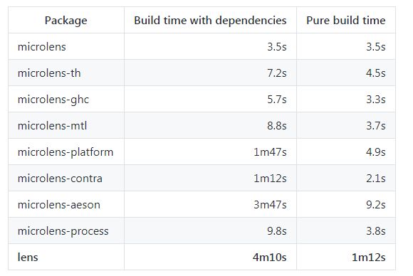

# A Comparison Between CI/CD Solutions

| **Solution** | **Github Actions** | **TravisCI** | **Jenkins** |
| --- | --- | --- | --- |
| Setup | Create conf and go | Create conf and go | Hard&Elaborate setup (hosted internally)
| Free plan for opensource | ✔️ | ✔️ | Free
| Documentation | ✔️ | ✔️ | ✔️ |
| Additional documentation (Community driven tools/ Plugins) | ✔️ | **X** | Many more than rest
| Github Usage | Best | Satisfying | Just good
| Paralellism | ✔️ | ✔️ | ✔️ |
| Distributed builds | **X** | **X** | ✔️ |
| Containers support / Build environment | ✔️ | ✔️ | ✔️ |
| Analytics / Status overview | ✔️ | ✔️ | ✔️ |
| Build CD Pipelines | ✔️ | **X** | ✔️ |
| Multiple language support: | ✔️ | ✔️ | ✔️ |
| Integration possibility? | ✔️ | ✔️ | ✔️ |
| API |**?**| ✔️(powerful) | ✔️(powerful) |

### Unique Feature
- Github Actions - best Github integration
- TravisCI - Build Matrix, ease of use, GitHub integration 
- Jenkins - Vast configuration possibilities & 1500 usable plugins

### Free plan benefits:

- [Github Actions](http://hackage.haskell.org/package/lens-simple)  Unlimited public/private repositories, collaborators with 2,000 Actions minutes/month
500MB of GitHub Packages storage
- [TravisCI](https://travis-ci.com/) Unlimited builds and 5 concurrent jobs 
- [Jenkins](https://www.jenkins.io/) Opensource

### Documentation

- [Github Actions](https://help.github.com/en/actions)
- [TravisCI](https://docs.travis-ci.com/)
- [Jenkins](https://www.jenkins.io/doc/book/)

### Additional documentation

- Github Actions - Wide varierty of available pre-made workflows, which you can browse right on the homepage: https://github.com/features/actions.
- TravisCI - No plugin/other tools support
- Jenkins - https://plugins.jenkins.io/

### Paralellism reefer to tasks that can be run concurently on the same machine

- Github Actions - Matrix builds allow concurrent jobs, even multi-platform.
- TravisCI - TravisCI makes it very easy to split your build into different stages which are then run in parallel (ie: run integration tests separate from the unit tests). TravisCI calls this a build matrix: https://docs.travis-ci.com/user/build-matrix/.
- Jenkins - https://www.cloudbees.com/blog/parallelism-and-distributed-builds-jenkins

### Distributed builds refeer to tasks that can be scaled horizontally, on multiple machines

### Containers support / Build environment

- Github Actions - Linux, macOS, Windows, and containers, or run directly in a VM.
- TravisCI - TravisCI runs each build in a isolated virtual machine. Pre-build packages include a few which support specific languages (Ruby and JavaScript included) or other software (Git, various databases), but vanilla packages such as Ubuntu Trusty are also available.
- Jenkins - https://www.jenkins.io/doc/book/pipeline/docker/

### Analytics / Status overview

- Github Actions - Minimal status overview definitely available, with live logs and GitHub integration. Unclear how far it goes.
- TravisCI - Available by default in Travis (this is what most of the web UI consists of)
- Jenkins - [Dash tutorial](https://www.cloudbees.com/blog/audit-trail-dashboard-cloudbees-jenkins-analytics)

### CD Pipelines = A continuous delivery pipeline is a description of the process that the software goes through from a new code commit, through testing and other statical analysis steps all the way to the end-users of the product.

- "Github Actions Workflows", they are defined in separate Docker containers, using the YAML syntax (they used to support HCL, but they're migrating away from that)
- TravisCI - Not available, because it is specifically built around GitHub pull requests. Pipelines can be defined, but parts of the process need to be implemented separatelly in GitHub.
- Jenkins - fully configurable

### Reports refeer to the abilty to see specific reports (like code coverage or custom ones), but not necesarily tied in into a larger dashboard.

- TravisCI - No persistent storage eliminates the possibility of code coverage reports on TravisCI alone. There is support for integrated 3rd parties such as "Coveralls" for reporting code coverage.
- Jenkins - Can be implemented

### Language support

- [Github Actions Language Support conf.yml](https://github.com/actions/starter-workflows/tree/master/ci) 
- [TravisCI Language Support conf.yml](https://docs.travis-ci.com/user/languages/)
- Jenkins has plugin to integrate ANY

### Integrations refeers to 1st party support for common tools (like Slack notifications, various VCS platforms, etc)

- Github Actions AWS, Azure, Zeit, Kubernetes and many more
- TravisCI Strong support for 3rd party tools like Coveralls, BrowserStack, etc.
- Jenkins Heh

### API (By "powerful" I want to say that it is able to use the api to start/cancel test)

- GitHub Actions - will be integrated with the GitHub GraphQL API (one of the more mature GraphQL API implementations available). Haven't found something concrete yet.
- TravisCI - Offers a feature-rich API that allows both reading data, as well as triggering or cancelling builds.
- [Jenkins](https://www.jenkins.io/doc/book/using/remote-access-api/)
